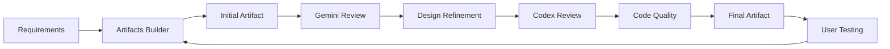

# Artifacts Builder

**Build powerful, production-ready React artifacts for Claude.ai conversations**

The Artifacts Builder skill enables Claude to create sophisticated, interactive frontend applications that run directly in the Claude.ai chat interface as HTML artifacts. Using a modern tech stack (React 18, TypeScript, Tailwind CSS, and shadcn/ui), this skill transforms complex UI requirements into polished, self-contained artifacts that users can interact with immediately.

## Overview

Artifacts in Claude.ai are self-contained HTML documents that can include interactive React applications. The Artifacts Builder skill provides a complete workflow for creating these artifacts:

1. **Initialize** a React project with full TypeScript and UI component support
2. **Develop** using 40+ pre-configured shadcn/ui components
3. **Bundle** the entire application into a single HTML file
4. **Share** the artifact directly in conversation
5. **Iterate** based on user feedback with instant updates

### When to Use This Skill

**Use Artifacts Builder for:**
- Interactive dashboards with real-time data visualization
- Complex forms with validation and multi-step workflows
- Games and interactive experiences
- Data exploration tools with filtering and search
- Rich UI components requiring state management
- Multi-page applications with routing
- Applications requiring professional design systems

**Don't use for:**
- Simple static HTML pages (use basic HTML artifacts instead)
- Single-component demonstrations (unnecessary overhead)
- Backend APIs or server-side logic (artifacts are frontend-only)

### Design Philosophy

The skill emphasizes avoiding "AI slop" - the generic aesthetic patterns that make AI-generated interfaces feel cookie-cutter. Key principles:

- **Avoid excessive centered layouts** - Use asymmetric, purposeful arrangements
- **No purple gradients by default** - Choose contextually appropriate color schemes
- **Vary border radius** - Not everything needs rounded corners
- **Don't default to Inter font** - Explore typography that fits the use case
- **Intentional white space** - Balance density and breathing room

## Tech Stack

The Artifacts Builder uses a carefully selected, production-ready stack:

| Technology | Version | Purpose |
|------------|---------|---------|
| **React** | 18.x | Component-based UI framework |
| **TypeScript** | 5.x | Type-safe development |
| **Vite** | 5.4.11+ | Fast development and builds |
| **Tailwind CSS** | 3.4.1 | Utility-first styling |
| **shadcn/ui** | Latest | 40+ pre-built components |
| **Radix UI** | Latest | Accessible primitives |
| **Parcel** | Latest | Single-file bundling |

### Why This Stack?

- **React 18**: Industry-standard framework with excellent documentation
- **TypeScript**: Catches errors at compile time, improves maintainability
- **Vite**: Lightning-fast hot module replacement during development
- **Tailwind CSS**: Rapid styling without context switching
- **shadcn/ui**: Beautiful, accessible components you own (not a dependency)
- **Parcel**: Bundles everything into a single, shareable HTML file

## Quick Start

### Installation

The skill is available in Claude.ai for paid users and can be loaded via Claude Code or the API. No manual installation required.

For Claude Code:
```bash
/plugin marketplace add anthropics/skills
/plugin install example-skills@anthropic-agent-skills
```

### Basic Workflow

#### 1. Initialize Project

```bash
bash scripts/init-artifact.sh my-dashboard
cd my-dashboard
```

This creates a complete React project with:
- React 18 + TypeScript configured
- Tailwind CSS with shadcn/ui theming
- 40+ shadcn/ui components pre-installed
- All Radix UI dependencies
- Path aliases (`@/components`, `@/lib`, etc.)
- Parcel bundling configuration

#### 2. Develop Your Artifact

Edit the generated files in `src/`:

```typescript
// src/App.tsx
import { Button } from '@/components/ui/button'
import { Card, CardHeader, CardTitle, CardContent } from '@/components/ui/card'

function App() {
  return (
    <div className="p-8">
      <Card>
        <CardHeader>
          <CardTitle>My Artifact</CardTitle>
        </CardHeader>
        <CardContent>
          <Button>Click me</Button>
        </CardContent>
      </Card>
    </div>
  )
}

export default App
```

Test locally:
```bash
pnpm dev
```

#### 3. Bundle to Single HTML

```bash
bash scripts/bundle-artifact.sh
```

This creates `bundle.html` - a self-contained artifact with all JavaScript, CSS, and dependencies inlined.

#### 4. Share with User

Present the `bundle.html` file in the Claude conversation as an artifact. Users can interact with it immediately in their browser.

## Component Library

The skill includes 40+ shadcn/ui components, all accessible via the `@/components/ui` path alias:

### Layout & Structure
- **Card** - Flexible container with header, content, and footer sections
- **Separator** - Visual dividers between content sections
- **Aspect Ratio** - Maintain consistent aspect ratios for media
- **Resizable** - User-adjustable panel layouts
- **Scroll Area** - Custom-styled scrollable containers

### Navigation
- **Navigation Menu** - Responsive navigation bars with dropdowns
- **Breadcrumb** - Hierarchical navigation trails
- **Menubar** - Application-style menu bars
- **Tabs** - Tab-based content organization

### Forms & Inputs
- **Form** - React Hook Form integration with validation
- **Input** - Text input fields
- **Textarea** - Multi-line text input
- **Select** - Dropdown select menus
- **Checkbox** - Toggle checkboxes
- **Radio Group** - Single-choice radio buttons
- **Switch** - Toggle switches
- **Slider** - Range sliders
- **Calendar** - Date picker with react-day-picker
- **Command** - Command palette (⌘K style)

### Feedback & Status
- **Alert** - Contextual alert messages
- **Toast** - Temporary notification messages
- **Sonner** - Modern toast notifications
- **Progress** - Progress bars and indicators
- **Skeleton** - Loading state placeholders
- **Badge** - Status indicators and labels

### Overlays & Dialogs
- **Dialog** - Modal dialogs
- **Sheet** - Slide-in panels
- **Drawer** - Bottom drawer component (vaul)
- **Popover** - Floating content containers
- **Tooltip** - Contextual help text
- **Hover Card** - Rich hover previews
- **Context Menu** - Right-click menus
- **Dropdown Menu** - Action menus

### Data Display
- **Table** - Styled data tables
- **Accordion** - Collapsible content sections
- **Collapsible** - Simple show/hide content
- **Carousel** - Image/content carousels (Embla)
- **Avatar** - User profile pictures

### Interactive Elements
- **Button** - Various button styles and sizes
- **Toggle** - Toggle buttons
- **Toggle Group** - Grouped toggle controls

### Utilities
- **Label** - Form labels
- **@/lib/utils** - Utility functions (cn, clsx, tailwind-merge)
- **@/hooks/use-toast** - Toast notification hook

## Example Artifacts

### 1. Interactive Dashboard

A data visualization dashboard with filtering, search, and real-time updates.

**Use case**: Display analytics, metrics, or monitoring data with interactive controls.

**Key components**: Card, Table, Select, Input, Badge, Chart (custom)

**Features**:
- Filterable data tables
- Search functionality
- Responsive grid layout
- Status indicators with badges
- Export capabilities

### 2. Multi-Step Form

A complex form wizard with validation, error handling, and progress tracking.

**Use case**: User onboarding, survey collection, configuration wizards.

**Key components**: Form, Input, Select, Button, Progress, Tabs

**Features**:
- Step-by-step navigation
- Field validation with error messages
- Progress indicator
- Form state persistence
- Conditional logic

### 3. Task Management App

A kanban-style task board with drag-and-drop, filtering, and search.

**Use case**: Project management, issue tracking, workflow visualization.

**Key components**: Card, Button, Dialog, Select, Badge, Command

**Features**:
- Drag-and-drop task cards
- Status columns (To Do, In Progress, Done)
- Task creation dialog
- Quick search with Command palette
- Priority indicators

### 4. Data Explorer

An interactive data exploration tool with filtering, sorting, and visualization.

**Use case**: Browse datasets, API responses, or structured information.

**Key components**: Table, Input, Select, Popover, Sheet, Accordion

**Features**:
- Sortable columns
- Advanced filtering
- Column visibility toggles
- Detail panels with Sheet
- Export to CSV

### 5. Interactive Game

A simple game or puzzle with state management and animation.

**Use case**: Educational tools, entertainment, interactive demonstrations.

**Key components**: Button, Card, Dialog, Toast, Progress

**Features**:
- Game state management
- Score tracking
- Victory conditions
- Restart functionality
- Sound effects (optional)

## Best Practices

### Architecture

1. **Component Organization**
   - Keep components small and focused
   - Extract reusable logic into custom hooks
   - Use TypeScript interfaces for props

2. **State Management**
   - Use React hooks (useState, useReducer) for local state
   - Consider context for shared state
   - Keep state close to where it's used

3. **Styling**
   - Use Tailwind utility classes for most styling
   - Create custom classes in index.css for repeated patterns
   - Leverage shadcn/ui's theming system for consistent design

### Performance

1. **Bundle Size**
   - Only import components you actually use
   - Avoid large third-party libraries when possible
   - Use dynamic imports for large features

2. **Rendering**
   - Memoize expensive calculations with useMemo
   - Use useCallback for event handlers passed to children
   - Avoid inline object/array creation in render

### Accessibility

1. **Keyboard Navigation**
   - All shadcn/ui components are keyboard accessible
   - Test with Tab/Shift+Tab navigation
   - Ensure focus indicators are visible

2. **Screen Readers**
   - Use semantic HTML elements
   - Add aria-labels where needed
   - Test with screen reader tools

### Testing

1. **During Development**
   - Use `pnpm dev` for hot-reload testing
   - Test in multiple browsers (Chrome, Firefox, Safari)
   - Verify responsive behavior at different viewport sizes

2. **After Bundling**
   - Open `bundle.html` in browser to verify
   - Check browser console for errors
   - Test all interactive features

## Integration with AISkills

### Peer Review Workflows

The Artifacts Builder skill integrates seamlessly with peer review skills:

#### Gemini Peer Review
```
1. Build artifact with Artifacts Builder
2. Share bundle.html with Gemini for UI/UX review
3. Get feedback on accessibility, design patterns, and code quality
4. Iterate based on recommendations
```

Benefits of Gemini review:
- 1M token context window handles large artifacts
- Holistic codebase analysis
- Design pattern suggestions
- Alternative implementation approaches

#### Codex Peer Review
```
1. Build artifact with complex logic
2. Request Codex review of TypeScript code
3. Get feedback on type safety, error handling, and architecture
4. Refine implementation
```

Benefits of Codex review:
- Specialized in code architecture
- Security analysis
- Performance optimization suggestions
- Best practice validation

### Workflow Pattern



This iterative approach ensures artifacts meet both design and technical excellence standards.

## Advanced Topics

### Custom Component Creation

Build your own components following shadcn/ui patterns:

```typescript
// src/components/ui/custom-widget.tsx
import * as React from "react"
import { cn } from "@/lib/utils"

interface CustomWidgetProps extends React.HTMLAttributes<HTMLDivElement> {
  variant?: "default" | "fancy"
}

const CustomWidget = React.forwardRef<HTMLDivElement, CustomWidgetProps>(
  ({ className, variant = "default", ...props }, ref) => {
    return (
      <div
        ref={ref}
        className={cn(
          "rounded-lg border p-4",
          variant === "fancy" && "border-2 shadow-lg",
          className
        )}
        {...props}
      />
    )
  }
)
CustomWidget.displayName = "CustomWidget"

export { CustomWidget }
```

### Theme Customization

Modify Tailwind config for custom themes:

```javascript
// tailwind.config.js
module.exports = {
  theme: {
    extend: {
      colors: {
        brand: {
          DEFAULT: "hsl(210, 100%, 50%)",
          foreground: "hsl(0, 0%, 100%)",
        },
      },
    },
  },
}
```

Update CSS variables in `src/index.css`:

```css
:root {
  --brand: 210 100% 50%;
  --brand-foreground: 0 0% 100%;
}
```

### State Persistence

Add localStorage for state persistence:

```typescript
function usePersistedState<T>(key: string, defaultValue: T) {
  const [state, setState] = React.useState<T>(() => {
    const stored = localStorage.getItem(key)
    return stored ? JSON.parse(stored) : defaultValue
  })

  React.useEffect(() => {
    localStorage.setItem(key, JSON.stringify(state))
  }, [key, state])

  return [state, setState] as const
}
```

### Routing (Single-Page Navigation)

Use React state for simple routing:

```typescript
type Page = "home" | "settings" | "about"

function App() {
  const [currentPage, setCurrentPage] = React.useState<Page>("home")

  return (
    <div>
      <nav>
        <Button onClick={() => setCurrentPage("home")}>Home</Button>
        <Button onClick={() => setCurrentPage("settings")}>Settings</Button>
        <Button onClick={() => setCurrentPage("about")}>About</Button>
      </nav>

      {currentPage === "home" && <HomePage />}
      {currentPage === "settings" && <SettingsPage />}
      {currentPage === "about" && <AboutPage />}
    </div>
  )
}
```

## Troubleshooting

### Build Issues

**Problem**: `pnpm install` fails
- **Solution**: Ensure Node.js 18+ is installed (`node -v`)
- **Solution**: Clear pnpm cache: `pnpm store prune`

**Problem**: TypeScript errors about path aliases
- **Solution**: Restart TypeScript server in IDE
- **Solution**: Verify `tsconfig.json` and `vite.config.ts` are configured correctly

**Problem**: Bundle size is too large (>500KB)
- **Solution**: Remove unused component imports
- **Solution**: Avoid importing entire icon libraries
- **Solution**: Use dynamic imports for large features

### Runtime Issues

**Problem**: Component styling not applied
- **Solution**: Verify Tailwind directives in `src/index.css`
- **Solution**: Check component imports use correct path aliases

**Problem**: "Module not found" errors
- **Solution**: Ensure all dependencies are installed: `pnpm install`
- **Solution**: Check import paths match actual file structure

**Problem**: Artifact doesn't work when shared
- **Solution**: Verify `bundle.html` was created successfully
- **Solution**: Open `bundle.html` locally to check for console errors
- **Solution**: Ensure no external API calls that require CORS

## Resources

### Documentation
- [shadcn/ui Components](https://ui.shadcn.com/docs/components) - Complete component reference
- [Radix UI Primitives](https://www.radix-ui.com/primitives) - Underlying accessible components
- [Tailwind CSS](https://tailwindcss.com/docs) - Utility-first CSS framework
- [React Documentation](https://react.dev) - Official React guides
- [TypeScript Handbook](https://www.typescriptlang.org/docs/) - TypeScript reference

### Related Skills
- **frontend-design** - Alternative frontend design skill with different patterns
- **canvas-design** - Create visual art in PNG/PDF formats
- **theme-factory** - Apply pre-set themes to artifacts
- **brand-guidelines** - Use Anthropic brand colors and typography

### Community
- [shadcn/ui Discord](https://discord.com/invite/shadcn) - Component discussions
- [Anthropic Skills Repository](https://github.com/anthropics/skills) - Official skills collection
- [Claude.ai Community](https://support.claude.com/community) - User discussions

## Contributing

This skill is maintained by Anthropic as part of the official skills repository. For issues or suggestions:

1. Visit [anthropics/skills](https://github.com/anthropics/skills)
2. Check existing issues for similar requests
3. Open a new issue with detailed description
4. Follow contribution guidelines in repository

## License

This skill is licensed under the Apache License 2.0. See `LICENSE.txt` for complete terms.

**Copyright**: Anthropic PBC

**Integration**: This version has been packaged for the AISkills collection with additional documentation and peer review workflow integration.

## Version History

See `CHANGELOG.md` for detailed version history and updates.

---

**Part of the AISkills Collection** | [Skill Template](https://github.com/leegonzales/AISkills/SkillTemplate) | [Peer Review Skills](https://github.com/leegonzales/AISkills/GeminiPeerReview)
