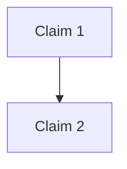

# Claimify Skill - Usage Guide

## What Is Claimify?

Claimify is a skill that transforms messy discourse into structured argument maps. It extracts claims, maps their logical relationships, identifies assumptions, and reveals the structure of reasoning.

**Use it for:**
- Debate analysis
- Strategic document review  
- Meeting notes → decision maps
- Research synthesis
- Red-teaming your own arguments
- Identifying logical gaps and contradictions

---

## Installation

1. Upload the `claimify.skill` file to Claude
2. The skill will be available in your current conversation
3. Trigger it by asking Claude to analyze arguments, extract claims, or map logic

---

## How to Use

### Trigger Phrases

Claimify activates when you ask things like:
- "What are the claims in this argument?"
- "Analyze this debate"
- "Map the logical structure"
- "What assumptions does this make?"
- "Extract the reasoning"
- "Find contradictions"
- "Red-team this argument"

### Analysis Levels

**Surface** - Quick scan
- Extract explicit claims only
- Basic relationships
- Fast turnaround

**Standard** (default) - Balanced depth
- Explicit claims + obvious implicit assumptions
- Clear logical relationships
- Flag contradictions

**Deep** - Comprehensive analysis
- All claims (explicit + implicit)
- Full logical structure
- Hidden assumptions
- Completeness analysis
- Red-teaming
- Strengthening suggestions

Specify your desired level: "Do a deep analysis of..." or "Give me a surface-level claim extraction"

---

## Output Formats

### Table (Default)

Best for quick reference and claim tracking.

```markdown
| ID | Claim | Type | Supports | Opposes | Assumes |
|----|-------|------|----------|---------|---------|
```

### Graph (Mermaid)

Best for visualizing argument structure and relationships.



### Narrative

Best for understanding the flow of reasoning and identifying tensions.

Structured prose showing logical progression and meta-analysis.

### JSON

Best for programmatic processing or integration with other tools.

Includes claims array, relationships, and meta-analysis.

**Specify format:** "Extract claims as JSON" or "Show me a graph of the argument"

---

## Quick Start Examples

### Example 1: Analyze a Simple Argument

**You:** 
```
Analyze this argument:

"Remote work is better because it saves commute time. 
Therefore, all companies should go fully remote."
```

**Claude (using Claimify):**

| ID | Claim | Type | Supports | Opposes | Assumes |
|----|-------|------|----------|---------|---------|
| C1 | Remote work saves commute time | Factual | C3 | - | - |
| C2 | [Implicit] Time savings are paramount | Assumption | C3 | - | - |
| C3 | All companies should go fully remote | Normative | - | - | C1, C2 |

**Analysis:** The argument makes an unstated assumption (C2) and uses an absolute claim ("all companies") without considering exceptions.

---

### Example 2: Debate Analysis

**You:**
```
Map this debate:

Speaker A: "We need AI regulation now to prevent harm."
Speaker B: "Regulation will kill innovation. We should wait."
```

**Claude outputs:** A Mermaid graph showing the opposing claim structures and where they conflict.

---

### Example 3: Red-Team Your Own Thinking

**You:**
```
Red-team this argument I'm making:

"AI training programs fail because they focus on tools 
instead of mental models. AI Flight School succeeds because 
it teaches thinking patterns, not button-clicking."
```

**Claude identifies:**
- Unstated assumptions about what "success" means
- Missing evidence for the causal claim
- Potential false dichotomy (tools vs. mental models)
- Suggestions for strengthening the argument

---

## Best Practices

### 1. Provide Context
Give Claude enough material to extract meaningful claims:
- Full paragraphs, not sentence fragments
- Complete arguments, not isolated claims
- Context about the discussion if relevant

### 2. Specify What You Need
- Want just the main claims? Say "surface level"
- Need deep analysis? Ask for "deep dive with assumptions"
- Looking for contradictions? Ask explicitly

### 3. Choose the Right Format
- **Exploring?** → Narrative format
- **Tracking?** → Table format
- **Presenting?** → Graph format
- **Processing?** → JSON format

### 4. Iterate
Start with standard analysis, then:
- Ask for deeper analysis of specific claims
- Request strengthening suggestions
- Have Claude red-team the argument

---

## Advanced Usage

### Synthesizing Multiple Sources

"Synthesize claims across these three documents and show me where they agree, disagree, and what's unstated."

### Decision Mapping

"Extract the decision structure from this meeting transcript—what claims support each option?"

### Research Analysis

"Analyze the claim structure across these papers and identify research gaps."

### Strengthening Arguments

"Red-team my argument and suggest how to make it stronger."

---

## Technical Details

### What's Included

**SKILL.md**
- Core workflow and guidelines
- Output format specifications
- Analysis depth levels
- Best practices

**references/examples.md**
- 6 detailed worked examples
- Different use cases and formats
- Meta-analysis patterns

**scripts/claim_validator.py**
- JSON validation utility
- Checks claim structure
- Verifies relationships
- Catches common errors

### Claim Types Recognized

- **Factual**: Empirical statements
- **Normative**: Value judgments, "should" statements
- **Definitional**: Establishing meaning
- **Causal**: X causes Y
- **Predictive**: Future-oriented claims
- **Assumption**: Unstated premises

### Relationship Types Mapped

- **Supports**: Evidence/reasoning for
- **Opposes**: Undermines/contradicts
- **Assumes**: Requires to be true
- **Refines**: Specifies/clarifies
- **Contradicts**: Mutually exclusive

---

## Troubleshooting

**"Claude isn't using Claimify"**
→ Try explicit trigger: "Use the Claimify skill to analyze..."

**"Output is too verbose"**
→ Ask for table format: "Give me a table of claims"

**"Not finding implicit assumptions"**
→ Request deep analysis: "Do a deep dive and surface all assumptions"

**"Missing relationships"**
→ Ask explicitly: "What supports/opposes each claim?"

---

## Questions?

- Check `references/examples.md` for 6 detailed examples
- Use the validator: `python scripts/claim_validator.py your_claims.json`
- Ask Claude to explain any part of the analysis

---

## Meta: How This Skill Was Built

This skill follows the skill-creator framework's doctrine:

1. **Concise core**: SKILL.md is lean (under 500 lines)
2. **Progressive disclosure**: Examples split into references/
3. **Appropriate freedom**: High freedom (guidelines, not strict rules)
4. **Bundled utility**: Validator script for JSON validation
5. **Examples over explanation**: 6 worked examples vs. lengthy prose

The skill can be used as a template for building similar analytical tools—claim extraction patterns can adapt to other structured analysis tasks (assumption mapping, evidence synthesis, etc.).
