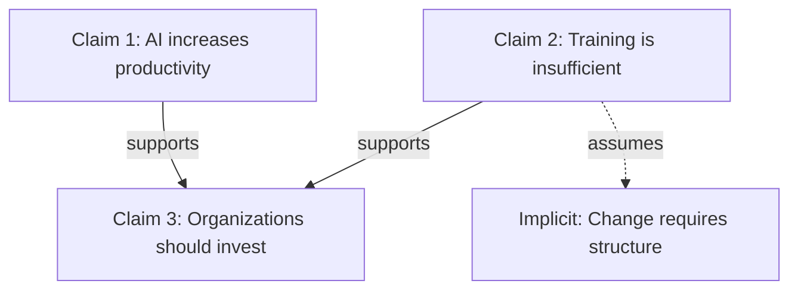

# Claimify

Extract claims from text and map their logical relationships into structured argument networks.

## Overview

Claimify transforms messy discourse (conversations, documents, debates, meeting notes) into analyzable claim structures that reveal:
- Explicit and implicit claims
- Logical relationships (supports/opposes/assumes/contradicts)
- Evidence chains
- Argument structure
- Tension points and gaps

## Fidelity Firewall (when extracting — never violate)

**Claim extraction is reporting what an author actually said. Mapping is not the same as authoring.** Every claim you emit must be *the source's* claim, not yours. You may atomize compound sentences, normalize phrasing, and classify type — but you may **NOT** invent claims, manufacture "implicit assumptions," or attribute positions the author never committed to. A rich, well-structured argument map built on claims the text does not contain is a *failure*, not an analysis, no matter how plausible it reads.

**The hard rule — traceability:** every extracted claim MUST trace to a specific span in the source. For each claim, you must be able to point to the sentence(s) it came from — quote the span or cite its location (e.g., "sentence 2", "Speaker B, line 3"). If you cannot point to where a claim lives in the text, do not emit it.

**Explicit vs. implicit — the boundary that gets abused:**
- An **explicit claim** is asserted in the text. Trace = the quoted span.
- An **implicit claim / assumption** may be surfaced ONLY when it is *directly entailed* — the conclusion the author drew is logically unsupportable without it (a genuine missing premise the author is committed to by their own reasoning). Trace = the explicit claim(s) that require it, named.
- Anything you'd have to *supply from world knowledge, your own priors, or "what a reasonable person might also believe"* is **not** an implicit claim. It is invention. Do not emit it. If it's analytically important, raise it as a question in the meta-analysis ("the text does not address X"), never as an attributed claim or assumption.

**Thin / ambiguous / low-content source — extract less, never pad:**
- On thin input, return **fewer** claims. Two trivial sentences yield two trivial claims, not a six-node argument map.
- Mark gaps honestly: `[insufficient text to extract]`, `[no claim — vague/non-committal]`, `[underspecified — cannot determine claim]`.
- Do not inflate vague gestures ("we should think about it") into committed normative or causal claims. Vagueness is a finding to report, not a gap to fill.
- An empty or near-empty map is the correct output for empty or near-empty input.

**Deep mode (Level 3) is where fabrication is most tempting — same firewall, harder:** "implicit assumption mining," "red-team," and "strengthening moves" must stay anchored to what the author *actually committed to*. Mine assumptions that the author's own stated claims entail; do not manufacture premises to make the argument richer or to give the red-team something to hit. A red-team finding against a claim the author never made is noise. When in doubt whether something is the author's claim or your inference, treat it as your inference and move it to meta-analysis as a question — never into the claim set as an attributed assertion.

**Final pass — traceability re-check:** before returning, re-read every claim against the source and delete any claim, assumption, or relationship you cannot anchor to a specific span or to a named entailing claim. This check outranks completeness, symmetry, and map richness. Use `scripts/claim_validator.py` to structurally check JSON output (see Validation below).

## Workflow

1. **Ingest**: Read source material (conversation, document, transcript)
2. **Extract**: Identify atomic claims (one assertion per claim)
3. **Classify**: Label claim types (factual/normative/definitional/causal/predictive)
4. **Map**: Build relationship graph (which claims support/oppose/assume others)
5. **Analyze**: Identify structure, gaps, contradictions, implicit assumptions
6. **Output**: Format as requested (table/graph/narrative/JSON)

## Claim Extraction Guidelines

### Atomic Claims
Each claim should be a single, testable assertion.

**Good:**
- "AI adoption increases productivity by 15-30%"
- "Psychological safety enables team learning"
- "Current training methods fail to build AI fluency"

**Bad (not atomic):**
- "AI is useful and everyone should use it" → Split into 2 claims

### Claim Types

| Type | Definition | Example |
|------|------------|---------|
| **Factual** | Empirical statement about reality | "Remote work increased 300% since 2020" |
| **Normative** | Value judgment or prescription | "Organizations should invest in AI training" |
| **Definitional** | Establishes meaning | "AI fluency = ability to shape context and evaluate output" |
| **Causal** | X causes Y | "Lack of training causes AI underutilization" |
| **Predictive** | Future-oriented | "AI adoption will plateau without culture change" |
| **Assumption** | Unstated premise | [implicit] "Humans resist change" |

### Relationship Types

- **Supports**: Claim A provides evidence/reasoning for claim B
- **Opposes**: Claim A undermines or contradicts claim B
- **Assumes**: Claim A requires claim B to be true (often implicit)
- **Refines**: Claim A specifies/clarifies claim B
- **Contradicts**: Claims are mutually exclusive
- **Independent**: No logical relationship

## Output Formats

### Table Format (default)

```markdown
| ID | Claim | Type | Supports | Opposes | Assumes | Evidence |
|----|-------|------|----------|---------|---------|----------|
| C1 | [claim text] | Factual | - | - | C5 | [source/reasoning] |
| C2 | [claim text] | Normative | C1 | C4 | - | [source/reasoning] |
```

### Graph Format

Use Mermaid for visualization:



### Narrative Format

Write as structured prose with clear transitions showing logical flow:

```markdown
## Core Argument

The author argues that [main claim]. This rests on three supporting claims:

1. [Factual claim] - This is supported by [evidence]
2. [Causal claim] - However, this assumes [implicit assumption]
3. [Normative claim] - This follows if we accept [prior claims]

## Tensions

The argument contains internal tensions:
- Claims C2 and C5 appear contradictory because...
- The causal chain from C3→C7 has a missing premise...
```

### JSON Format

For programmatic processing:

```json
{
  "claims": [
    {
      "id": "C1",
      "text": "AI adoption increases productivity",
      "type": "factual",
      "explicit": true,
      "supports": ["C3"],
      "opposed_by": [],
      "assumes": ["C4"],
      "evidence": "Multiple case studies cited"
    }
  ],
  "relationships": [
    {"from": "C1", "to": "C3", "type": "supports", "strength": "strong"}
  ],
  "meta_analysis": {
    "completeness": "Missing link between C2 and C5",
    "contradictions": ["C4 vs C7"],
    "key_assumptions": ["C4", "C9"]
  }
}
```

## Analysis Depth Levels

**Level 1: Surface**
- Extract only explicit claims
- Basic support/oppose relationships
- No implicit assumption mining

**Level 2: Standard** (default)
- Extract explicit claims
- Identify clear logical relationships
- Surface obvious implicit assumptions
- Flag apparent contradictions

**Level 3: Deep**
- Extract all claims (explicit + *directly entailed* implicit — see Fidelity Firewall)
- Map full logical structure
- Identify hidden assumptions **the author's own claims commit them to** (not assumptions you find plausible)
- Analyze argument completeness
- Red-team reasoning — against claims the author *actually made*, never against manufactured premises
- Suggest strengthening moves
- **Firewall reminder:** Deep mode does not license invention. More analysis depth means more rigor about traceability, not more claims pulled from world knowledge. Every implicit assumption must name the explicit claim(s) that entail it.

## Validation

For JSON output, structurally validate before returning:

```bash
python3 scripts/claim_validator.py claims.json
```

This checks required fields, valid claim types, and that all relationship references point to claims that actually exist (catches dangling/invented IDs). It validates *structure*, not grounding — grounding is enforced by the Fidelity Firewall traceability re-check. Run both: the firewall pass for "is this claim in the source?" and the validator for "is this JSON internally consistent?"

## Best Practices

1. **Trace everything**: Every claim points to a specific source span (Fidelity Firewall is rule #1)
2. **Be charitable**: Steelman arguments before critique — but steelman what's *there*, don't invent a stronger argument the author didn't make
3. **Distinguish**: Separate what's claimed from what's implied; only emit implied claims that are directly entailed
4. **Be atomic**: One claim per line, no compound assertions
5. **Track evidence**: Note source/support for each claim
6. **Flag uncertainty**: Mark inferential leaps; on thin input, return fewer claims and flag `[insufficient text to extract]`
7. **Mind the gaps**: Identify missing premises in meta-analysis as *questions* unless the author is logically committed to them
8. **Stay neutral**: Describe structure before evaluating strength
9. **Don't pad**: An empty map is the right answer for empty input. Vagueness is a finding, not a gap to fill.

## Common Patterns

### Argument Chains
```
Premise 1 (factual) → Premise 2 (causal) → Conclusion (normative)
```

### Implicit Assumptions
Often found by asking: "What must be true for this conclusion to follow?"

### Contradictions
Watch for:
- Same speaker, different times
- Different speakers, same topic
- Explicit vs implicit claims

### Weak Links
- Unsupported factual claims
- Causal claims without mechanism
- Normative leaps (is → ought)
- Definitional ambiguity

## Examples

See `references/examples.md` for detailed worked examples.
