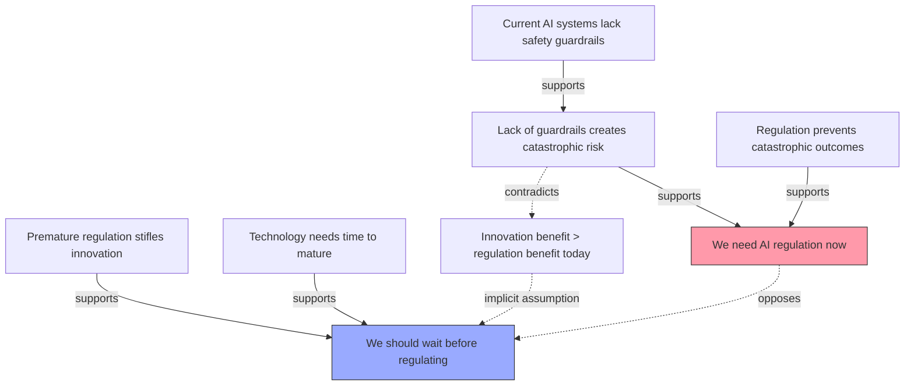

# Claimify Examples

## Example 1: Simple Argument Analysis

**Input text:**
"Remote work saves companies money because it reduces real estate costs. Therefore, all companies should adopt remote-first policies."

**Claimify output (Table format):**

| ID | Claim | Type | Supports | Opposes | Assumes | Evidence |
|----|-------|------|----------|---------|---------|----------|
| C1 | Remote work saves companies money | Factual | C3 | - | C2 | Stated premise |
| C2 | [Implicit] Cost savings are the primary decision factor | Assumption | C3 | - | - | Required for conclusion |
| C3 | All companies should adopt remote-first policies | Normative | - | - | C1, C2 | Conclusion |
| C4 | Remote work reduces real estate costs | Factual | C1 | - | - | Stated premise |

**Analysis:**
- Missing premise: C2 is never stated but required for the argument
- Weak link: "All companies" is absolute—no consideration of exceptions
- Implicit assumption: Real estate is significant cost for all companies

---

## Example 2: Debate Transcript

**Input:** Two speakers debating AI safety

**Speaker A:** "We need AI regulation now because current systems lack safety guardrails. Without regulation, we risk catastrophic outcomes."

**Speaker B:** "Premature regulation would stifle innovation. We should wait until the technology matures before imposing constraints."

**Claimify output (Graph format):**



**Meta-analysis:**
- **Core disagreement**: Timing—regulate now vs. later
- **Implicit assumption (A)**: Regulation won't stifle beneficial innovation
- **Implicit assumption (B)**: Current risks are acceptable/manageable
- **Missing claims**: Neither addresses enforcement mechanisms or what "mature" means

---

## Example 3: Strategic Document

**Input:** Excerpt from AI transformation strategy doc

"Organizations adopting AI report 20-30% productivity gains, but most implementations fail due to inadequate training. AI Flight School addresses this by building fluency through practice-based learning rather than passive instruction. This approach creates sustainable capability because it develops mental models, not just surface skills."

**Claimify output (Narrative format):**

## Core Argument

The document argues that **practice-based AI training creates sustainable organizational capability** (C7 - normative/predictive). This rests on a chain of supporting claims:

### Factual Foundation
1. **C1**: Organizations adopting AI report 20-30% productivity gains (Factual)
   - Establishes baseline opportunity
   - Evidence: "report 20-30%" (likely citing studies)

2. **C2**: Most AI implementations fail (Factual)
   - Tension with C1—both can't fully capture reality
   - Needs definition of "fail"

3. **C3**: Implementation failures stem from inadequate training (Causal)
   - Critical link but unsupported
   - Assumes training is primary failure mode

### Proposed Solution
4. **C4**: AI Flight School builds fluency through practice-based learning (Definitional/Factual)
   - Describes approach

5. **C5**: Practice-based learning differs from passive instruction (Definitional)
   - Distinction claimed but not explained

### Mechanism Claims
6. **C6**: Practice-based learning develops mental models, not just surface skills (Causal)
   - Assumes mental models = better outcomes
   - Missing: what mental models? How measured?

7. **C7**: This approach creates sustainable capability (Predictive)
   - Main conclusion
   - Assumes: C3 (training is key) + C6 (mental models work) + [implicit] sustainability = mental models

## Implicit Assumptions

- **I1**: Mental models lead to better long-term performance than surface skills
- **I2**: Practice-based learning reliably builds mental models
- **I3**: The specific practice-based approach of AI Flight School is effective
- **I4**: Training is the primary bottleneck (vs. culture, tooling, incentives)

## Structural Analysis

**Strengths:**
- Clear causal chain from problem → solution → outcome
- Empirical grounding (C1 productivity stats)

**Weaknesses:**
- C2 and C1 create tension—are implementations succeeding or failing?
- C3 (training causes failure) is unsupported—correlation ≠ causation
- Mechanism (practice → mental models → sustainability) needs evidence
- Missing: comparison to alternatives, success metrics, failure modes

**Missing links:**
- What mental models specifically?
- How do we know practice builds them?
- Why is this superior to other training approaches?
- How do we measure sustainability?

---

## Example 4: Meeting Notes → Decision Map

**Input:** Meeting transcript about Q4 planning

**Output:**

| ID | Claim | Type | Speaker | Decision Impact |
|----|-------|------|---------|-----------------|
| C1 | Q4 revenue will miss target by 15% | Predictive | CFO | High - drives next 3 decisions |
| C2 | Sales team lacks AI tools | Factual | VP Sales | Medium |
| C3 | AI tools would close gap | Causal | VP Sales | High - contested by C5 |
| C4 | We should invest in AI tooling | Normative | VP Sales | **DECISION** |
| C5 | Problem is pipeline, not tools | Causal | CEO | High - opposes C3 |
| C6 | [Implicit] We can only afford one initiative | Assumption | - | Critical - unstated constraint |

**Decision structure:**
```
C1 (problem) → {C2+C3} vs {C5} → C4 (proposed action)
                  ↓                    ↓
              Sales view          CEO view
```

**Resolution needed:** C3 vs C5 contradiction—is it tools or pipeline?

---

## Example 5: Research Synthesis

**Input:** Synthesizing 3 papers on AI adoption

**Output (JSON format):**

```json
{
  "papers": ["Paper A", "Paper B", "Paper C"],
  "claims": [
    {
      "id": "C1",
      "text": "AI adoption correlates with productivity gains",
      "type": "factual",
      "sources": ["Paper A", "Paper C"],
      "agreement": "strong",
      "evidence_quality": "medium - correlation studies"
    },
    {
      "id": "C2", 
      "text": "Productivity gains require cultural change",
      "type": "causal",
      "sources": ["Paper B"],
      "agreement": "single source",
      "evidence_quality": "weak - case study only"
    },
    {
      "id": "C3",
      "text": "Technical training alone is insufficient",
      "type": "factual",
      "sources": ["Paper A", "Paper B"],
      "agreement": "moderate",
      "contradicts": ["C4"]
    },
    {
      "id": "C4",
      "text": "Technical skills predict AI usage",
      "type": "causal",
      "sources": ["Paper C"],
      "agreement": "contested",
      "contradicts": ["C3"]
    }
  ],
  "synthesis": {
    "consensus": ["C1"],
    "contested": ["C3 vs C4 - mechanism unclear"],
    "gaps": [
      "No longitudinal studies of sustainability",
      "Cultural change operationalized differently across papers",
      "Missing: measurement of 'fluency' vs 'skills'"
    ],
    "research_needed": [
      "RCT comparing training approaches",
      "Longitudinal tracking of capability retention",
      "Operationalize 'cultural change' construct"
    ]
  }
}
```

---

## Example 6: Red-Teaming Your Own Argument

**Input:** "AI will transform work fundamentally because it automates cognitive tasks, unlike previous technologies that only automated physical tasks."

**Claimify analysis:**

### Your Claims
| ID | Claim | Type | Status |
|----|-------|------|--------|
| C1 | AI automates cognitive tasks | Factual | ✓ Supported |
| C2 | Previous technologies only automated physical tasks | Factual | ✗ **FALSE** |
| C3 | Cognitive automation is fundamentally different | Causal | ⚠️ Needs support |
| C4 | AI will transform work fundamentally | Predictive | ⚠️ Depends on C2, C3 |

### Red-Team Findings

**Fatal flaw:** C2 is demonstrably false
- Spreadsheets automated cognitive work (calculation)
- Databases automated cognitive work (memory/retrieval)
- Compilers automated cognitive work (translation)

**Weakened conclusion:** If C2 falls, C4 needs new support. The argument becomes:
"AI automates cognitive tasks *at a different scale/scope* than previous technologies"

**Strengthen by:**
1. Replace C2 with: "AI automates a broader range of cognitive tasks"
2. Add: "AI handles ambiguity in ways previous automation couldn't"
3. Specify: What does "fundamentally transform" mean? (Scope ambiguity)

### Revised Argument
"AI will transform work in unprecedented ways because it automates cognitive tasks that require judgment and ambiguity-handling—capabilities previous automation couldn't replicate at scale."

**New structure:**
- More specific claim (ambiguity + judgment, not just "cognitive")
- Historical comparison that holds up
- "Unprecedented" instead of "fundamental" (less absolute)
