# Process Map Visual Templates

Standard formats for visualizing processes in different contexts.

## Template 1: Simple Linear Flow (Mermaid)

**Use for:** Sequential processes with minimal branching (≤10 steps)


**Elements:**
- Start node (green): What triggers this
- Process boxes (blue): Action steps
- Decision diamonds (yellow): Choice points
- End node (pink): Final state

---

## Template 2: Swimlane Diagram (Mermaid)

**Use for:** Multi-role processes showing handoffs


**Shows:**
- Who does what (vertical lanes)
- Handoff points (dotted lines)
- Parallel vs sequential activities

---

## Template 3: Decision Tree

**Use for:** Complex branching logic, diagnostic processes


**Shows:**
- All possible paths
- Decision criteria at each node
- Different outcomes

---

## Template 4: Process with Context Indicators

**Use for:** Showing complexity and context dependencies

```mermaid
graph LR
    A[Start] --> B["Step 1
    🟢 Simple/Low Context
    Zone 1"]
    B --> C["Step 2
    🟡 Moderate/Low Context
    Zone 2"]
    C --> D{"Decision Point
    ⚡ Tacit Knowledge
    Expert Required"}
    D -->|Path A| E["Step 3a
    🟡 Simple/High Context
    Zone 7"]
    D -->|Path B| F["Step 3b
    🟢 Simple/Low Context
    Zone 1"]
    E --> G[End]
    F --> G
    
    style B fill:#90EE90
    style C fill:#FFEB3B
    style D fill:#FF6B6B
    style E fill:#FFEB3B
    style F fill:#90EE90
```



**Color coding:**
- 🟢 Green: High automation potential (Zones 1-2)
- 🟡 Yellow: Medium potential (Zones 3-5)
- 🔴 Red: Low potential (Zones 6-9)

**Annotations:**
- ⚡ Tacit knowledge point
- 🧠 Domain expertise required
- ⚠️ Frequent failure point
- 🔄 Iterative loop

---

## Template 5: System Integration Map

**Use for:** Showing data flow across systems


**Highlights:**
- Manual touchpoints (red)
- Automated connections (green)
- System boundaries
- Data transformations

---

## Template 6: Timeline/Gantt View

**Use for:** Time-dependent processes, showing duration

```markdown
## Process Timeline

| Phase | Activity | Duration | Owner | Status |
|-------|----------|----------|-------|--------|
| 1 | Intake | 1 day | Requestor | ✓ |
| 2 | Review | 2-3 days | Approver | → |
| 3 | Execution | 5 days | Processor | |
| 4 | QA | 1 day | QA Team | |
| 5 | Delivery | 1 day | Processor | |

**Total:** 10-11 days
**Critical path:** Steps 2-3-4
**Bottleneck:** Approver (often delayed)
```

---

## Template 7: Value Stream Map

**Use for:** Lean analysis, identifying waste

```mermaid
graph LR
    A["Request Intake
    ⏱️ 5 min
    📊 100% accurate"] --> 
    B["⏸️ Wait in Queue
    ⏱️ 2 days
    🔴 Delay"]
    B --> C["Manual Review
    ⏱️ 30 min
    📊 95% accurate"]
    C --> D["⏸️ Wait for Approval
    ⏱️ 1 day
    🔴 Delay"]
    D --> E["Process Request
    ⏱️ 15 min
    📊 98% accurate"]
    
    style B fill:#FF6B6B
    style D fill:#FF6B6B
```



**Metrics per step:**
- ⏱️ Cycle time
- 📊 Quality/accuracy
- 🔴 Non-value-add time
- 🟢 Value-add time

---

## Template 8: Exception Flow Map

**Use for:** Showing normal vs exception paths


**Shows:**
- Frequency of each path
- Time implications
- Complexity differences

---

## Template 9: ASCII Flow (Simple Text)

**Use for:** Quick documentation, text-only contexts

```
[Start] → [Step 1] → [Decision] ─→ [Step 2a] → [End]
                         │
                         └─→ [Step 2b] → [End]

Annotations:
- Step 1: Low context, simple (5 min)
- Decision: Requires senior approval if >$5K
- Step 2a: Standard path (80% of cases)
- Step 2b: Exception path (20% of cases)
```

---

## Template 10: Dependency Map

**Use for:** Showing what enables what


**Shows:**
- Prerequisites (pink)
- Intermediate steps (yellow)
- End goals (green)
- Dependency relationships

---

## Notation Standards

### Shapes

**Rectangle:** Process step (action)
```
[Action Step]
```

**Diamond:** Decision point (branching)
```
{Decision?}
```

**Rounded rectangle:** Start/End
```
(Start) ... (End)
```

**Cylinder:** Data storage
```
[(Database)]
```

**Document:** Document/file
```
[/Invoice\]
```

**Cloud:** External system/service
```
((Cloud Service))
```

---

### Arrows

**Solid arrow:** Standard flow
```
A --> B
```

**Dotted arrow:** Optional/async
```
A -.-> B
```

**Bold arrow:** High volume/critical
```
A ==> B
```

**Bidirectional:** Two-way interaction
```
A <--> B
```

---

### Colors (Semantic)

**Green (#90EE90):** Good (automated, efficient, low risk)
**Yellow (#FFEB3B):** Caution (manual, moderate, medium risk)
**Red (#FF6B6B):** Problem (blocker, high risk, needs attention)
**Blue (#87CEEB):** Neutral (standard process step)
**Pink (#FFB6C1):** Start/End nodes

---

### Annotations

**Context level:**
- 🟢 Low context
- 🟡 Medium context
- 🔴 High context

**Complexity:**
- Simple: 1-5 steps
- Moderate: 6-15 steps
- Complex: 15+ steps

**Special markers:**
- ⚡ Tacit knowledge required
- 🧠 Domain expertise needed
- ⚠️ Frequent failure point
- 🔄 Iterative loop
- ⏸️ Wait state
- 🤖 Automation candidate
- 👤 Human judgment required

---

## Output Format Selection Guide

| Process Type | Best Template | Why |
|--------------|---------------|-----|
| Simple sequential | Linear Flow (#1) | Easy to follow |
| Multi-role | Swimlane (#2) | Shows handoffs |
| Complex branching | Decision Tree (#3) | All paths visible |
| Automation analysis | Context Indicators (#4) | Shows opportunities |
| System integration | Integration Map (#5) | Data flow clear |
| Time-critical | Timeline (#6) | Duration visible |
| Waste reduction | Value Stream (#7) | Identifies delays |
| Exception handling | Exception Flow (#8) | Path frequencies |
| Quick doc | ASCII Flow (#9) | No tool needed |
| Prerequisites | Dependency Map (#10) | Sequence clear |

---

## Tool Recommendations

**For creating diagrams:**

**Mermaid (recommended):**
- Text-based (version control friendly)
- Renders in markdown
- No special tools needed
- Example: See templates above

**LucidChart/Draw.io:**
- Visual editor
- More control over layout
- Export to PNG/PDF
- Collaboration features

**ASCII diagrams:**
- Universal compatibility
- No special tools
- Good for documentation
- Limited visual appeal

---

## Quality Checks for Visuals

**Good process map has:**
- [ ] Clear start and end
- [ ] All paths shown (including exceptions)
- [ ] Decision criteria at diamonds
- [ ] Consistent notation
- [ ] Annotations for complexity
- [ ] Legend if using symbols
- [ ] Readable at standard size
- [ ] Not too dense (split if >15 nodes)

**Bad process map:**
- Ambiguous starting point
- Missing exception paths
- Unlabeled decision points
- Inconsistent shapes/colors
- Too much detail (can't see structure)
- Too abstract (not actionable)
- Crosses/overlaps everywhere (messy layout)
