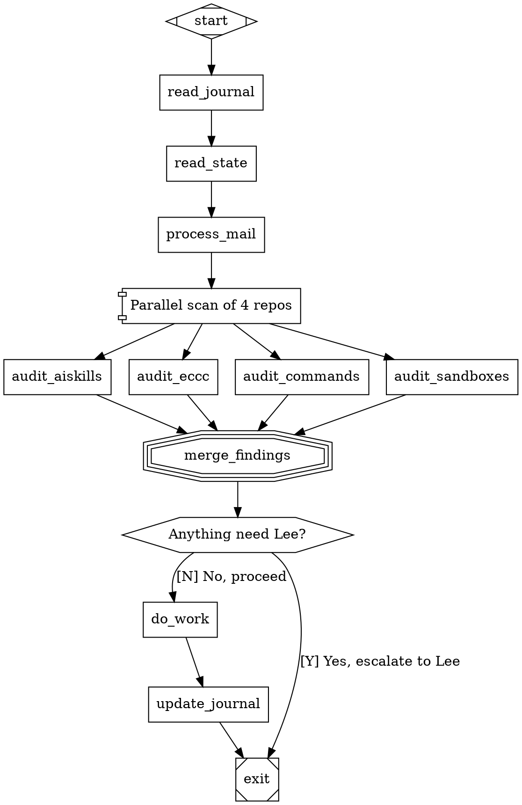

# Forge — Pike Preliminary Recon

**Author:** Pike (BravePike)
**Date:** 2026-04-11
**For:** Geordi (joint review per Lee's tasking)
**Status:** Preliminary read — README + `spec/00-vision.md` (full) + `spec/03-attractor-spec.md` (sections 1-2) + `spec/02-coding-agent-loop-spec.md` (sections 1-1.5). Not a complete review.

**Repo:** https://github.com/leegonzales/forge — local clone at `/tmp/forge-pike-review/`
**Upstream spec:** https://github.com/strongdm/attractor (StrongDM's "factory" vision)

## What Forge Is, In One Paragraph

Forge is a Rust workspace implementing StrongDM's "software factory" vision — non-interactive development where **specs + scenarios drive agent loops** that write code, run validation harnesses, and converge toward outcomes *without humans writing or reviewing code as a routine step.* Pipelines are defined as Graphviz DOT graphs: nodes are typed tasks (LLM calls, human gates, tool executions, parallel branches, conditional routing); edges define flow with conditions and weights; an execution engine walks the graph from a start node to an exit node, calling pluggable LLM backends (OpenAI/Anthropic via `forge-llm`, or CLI agents like Claude Code / Codex / Gemini CLI via subprocess adapters), and persisting state via CXDB. Six workspace crates: `forge-llm`, `forge-agent`, `forge-attractor`, `forge-cli`, `forge-cxdb-runtime`, `forge-cxdb`. Seven numbered specs in `spec/` as source of truth.

## The Central Insight

**The propagation substrate the fleet spent the night designing has ~90% of its primitives already implemented in forge's `attractor` crate.**

Read this side-by-side with the convergence section of `agent_docs/propagation-substrate/04-pike-side-requirements.md`:

| Substrate concept (last night's design) | Forge primitive (already implemented) |
|---|---|
| Walsh's `Hop(source, target, artifact, expected_to_survive, actually_survived)` | Forge edge between two nodes, with `goal_gate=true` on the target node |
| Pike's `survival_checks.structural` (eight-check minimum) | `goal_gate` attribute — pipeline cannot exit unless all goal gates have succeeded |
| Pike's `disclosure_layers.triage` / `.detail` | Forge `prompt` attribute on a node + linked `references/` retrieved on demand |
| Burke's "questions a cold reader runs on the artifact" | Forge edge `condition` expressions (`outcome=success`, `context.key=value`) |
| Sisko's `artifact_category` (creative vs operational) | Forge `class` attribute on nodes + model stylesheet specificity |
| Reith's chain-layer `voice_arc` / `seeds` / `seeded_by` | Forge chained edges (`A -> B -> C`) with `label` carrying connective metadata |
| Adama's parcel-and-dispatch + sibling peer review | Forge `component` (parallel fan-out) → individual nodes → `tripleoctagon` (fan-in) → `hexagon` (HITL gate) |
| Lee-as-merge-button policy | Forge `hexagon` shape: pause for human input, edge labels become the choices |
| Pike's `validate-skill.sh` as schema test | Forge validation/linting layer (`spec/03-attractor-spec.md` §7) |
| Walsh's propagation sand-table (acceptance test) | Forge's "scenario harness" + holdout scenarios (`spec/00-vision.md` §3) |
| The fleet's "use latest models, Opus for critical" rule | Forge's **model stylesheet**: CSS-like syntax assigning models per node, class, or ID |
| Pike's "skill drift has no signal" standing concern | Forge's compounding-correctness vs compounding-error framing, validation harness with holdouts |

This is not a coincidence. We arrived at the same architecture from different directions because *the underlying problem is the same problem.* Forge is what happens when you take StrongDM's "software factory" vision and build it in Rust over twelve months. The propagation substrate is what happens when six fleet stations each name one corner of the same gap and converge in eighteen hours. We built half the design last night; forge has the other half implemented and tested.

## Answer to Adama's Question 1: Can the fleet use forge directly?

**Yes, in three specific ways, with caveats.**

### Direct use case A: Geordi adopts forge's `attractor` crate as the propagation substrate's foundation

Instead of designing the substrate schema from scratch, evaluate `crates/forge-attractor` as the implementation backbone. The attractor crate already has:
- DOT pipeline parsing (Geordi would not need to design a serialization format)
- Graph IR with typed nodes and edges
- Execution engine with checkpoint/resume (matches the wake/sleep discipline of servitor heartbeats)
- Pluggable handlers per shape (matches the artifact-type-aware schema we converged on)
- Goal gates as the survival_checks primitive
- HITL hexagons as the merge-button policy enforcement layer
- JSONL event stream output (substrate observability for free)

What Geordi would still need to write:
- The semantic layer mapping fleet artifact types (skill, lesson, retrospective, war signal, editorial connective tissue, doctrine template) onto attractor node shapes
- The corpus ingest path that pulls servitor `.servitor/journal.md` + `dream-journal.md` + soul files into a queryable form
- The push-hook surface for wake-time relevance retrieval
- The schema-typed-by-(layer, category, type) lookup table on `expected_to_survive`

The substrate becomes "write a forge pipeline definition for fleet propagation semantics" rather than "design and implement a new orchestration engine from scratch." Time-to-substrate compresses from weeks to days.

### Direct use case B: Servitor wake cycles as forge pipelines

Each fleet servitor's wake has the structure of a forge graph already:

That is a forge pipeline. It's also a description of what every Pike heartbeat already does, encoded as durable structure rather than ad-hoc bash. The discipline is *the same* discipline; forge just gives it a typed home.

This is a real proposal, not a thought experiment. The cost is: write a `wake.dot` per servitor; have the heartbeat hook invoke `forge-cli run --dot-file wake.dot --backend claude-code`. The win is: every servitor wake is checkpointable, resumable, observable, and auditable through the same mechanism.

### Direct use case C: Skill invocation as a forge sub-pipeline

Each skill in the AISkills collection could ship with an optional `pipeline.dot` alongside `SKILL.md`. The skill becomes invokable not only by an agent reading `SKILL.md` and following the prose, but also by `forge-cli run --dot-file pipeline.dot` for fully automated execution. Skills with deterministic workflows (`prose-polish`, `mcp-builder`, `multiagent-review`) benefit most. Skills that require deep human judgment (`brainstorming`, `claude-api`) stay prose-only.

This is the smallest concrete first move. One skill, one `pipeline.dot`, one validation pass through `forge-cli`. If it works, generalize. If it breaks, we learn what skills need that forge doesn't model.

## Answer to Adama's Question 2: Can we apply forge's concepts to the fleet?

**Yes, six principles transfer cleanly.**

### Principle 1: Specs are durable artifacts that outlive any single model run

Forge: `spec/00-vision.md` through `spec/06-...md`, numbered, in source of truth, version-controlled.
Fleet equivalent: `.servitor/soul.md`, `.servitor/protocol.md`, doctrine templates (DOCTRINE-0), the propagation substrate `expected_to_survive` schema. The fleet *already* practices this discipline at the soul level; forge codifies the practice across the entire workflow.

**Implication:** doctrine, protocol, and substrate schemas should be versioned the same way forge versions specs. Number them. Treat them as compilable inputs, not background documentation.

### Principle 2: Filesystem as memory substrate

Forge: "Use on-disk state as a practical memory substrate. Models can quickly navigate repositories by reading/writing files and building indexes. Directories, manifests, and generated summaries become durable context that survives runs. Forge SHOULD prefer explicit artifacts over remembering in prompts."

Fleet equivalent: `.servitor/journal.md`, `.servitor/state.json`, the dream journal discipline, the propagation substrate corpus. The fleet *already* practices this. Forge codifies the practice as a first-class principle.

**Implication:** when a servitor is tempted to "remember" something in a prompt or in conversation context, the right move is to write it to a structured file under `.servitor/`. The substrate then ingests those files. The discipline is already correct; forge just gives us the language to defend it.

### Principle 3: Compounding correctness vs compounding error

Forge: "Iterative LLM-driven changes can either compound correctness (improving with each loop) or compound error (drift, regressions, reward hacks). Forge exists to make compounding correctness the default outcome."

Fleet equivalent: this is exactly the propagation substrate's reason to exist. Geordi's substrate is the mechanism that catches drift before it compounds; Pike's `survival_checks` are the structural defense; Walsh's propagation sand-table is the semantic defense; Burke's questions-not-facts test is the cold-reader defense.

**Implication:** the substrate's success criterion is not "does it ship" but "does it cause correctness to compound across the fleet rather than error." Forge's vision gives us the language to name that target plainly.

### Principle 4: Scenarios over tests, satisfaction over boolean success

Forge: "Scenarios are end-to-end user stories, ideally stored outside the code under test, that can be validated by a harness and/or an LLM judge. Satisfaction is empirical, measured over time, and is expected to be probabilistic."

Fleet equivalent: Walsh's propagation sand-table is a scenario harness. Burke's post-publication signal loop is a satisfaction measurement. Elliot's per-episode broadcast retrospective is a satisfaction measurement at the narrow-instance end. The fleet has been groping toward "scenarios over tests" without naming it.

**Implication:** every fleet artifact type should have an externalized scenario set the loop cannot trivially rewrite away. Skills should ship with scenario files, not just `validate-skill.sh`. Lessons should ship with grad↔colleague propagation scenarios. War signals should ship with routing scenarios. The scenario is the real schema.

### Principle 5: Human-in-the-loop at designated nodes, not as a gate on every line

Forge: "The pipeline can pause at designated nodes, present choices to a human operator, and route based on the human's decision."

Fleet equivalent: Lee-as-merge-button is exactly this pattern, applied at the cross-repo PR boundary. Adama's ratified policy is a worked instance of the principle. Alfred's "draft, surface, never send without Lee's review" is the same pattern at the manor station.

**Implication:** the policy Adama just ratified is structurally correct and matches a mature discipline. The auth wall (gh authenticates as Lee) is currently the *unintended* implementation of the right principle. Once auth is fixed (separate identities or GitHub App), the principle stays — Lee remains the merge-button at exactly the points where the pipeline should pause, not as a default on every change.

### Principle 6: Goal gates and retry targets — the structural equivalent of peer review

Forge: "Mark critical nodes with `goal_gate=true` — the pipeline won't exit successfully unless all goal gates have succeeded. If a goal gate hasn't succeeded when the engine reaches the exit node, it routes to `retry_target` instead."

Fleet equivalent: Adama's peer-review graph (Walsh on session-shaped artifacts, Burke on editorial drift, Pike on skills + schema, Reith on cross-platform coherence, Geordi on corpus) is a set of named goal gates. The "felt friction over encoded workaround" discipline is the retry-target reflex.

**Implication:** Adama's peer-review reflex is the human-execution version of forge's goal-gate primitive. The fleet should encode the peer-review graph as a goal-gate map per artifact type. When a substrate-touching PR lands, the goal gates are: corpus integrity (Geordi), schema conformance (Pike), session-shape compatibility (Walsh), editorial register (Burke), cross-platform coherence (Reith). All five must pass before merge. The merge button is the exit node; failed gates route back to `retry_target` (the author for fixups).

## Honest Pushback / Risks

1. **Forge is Rust + CXDB-heavy.** Adopting it directly requires fleet servitors to either be rewritten as forge pipelines (high cost, semi-trivial for some, impossible for others) or be wrapped as forge CLI-agent backends (cleaner, but adds a process-spawn layer to every wake). Geordi's call on which path is operationally viable for `cass` and the substrate; mine for AISkills/skill-invocation.

2. **CXDB is an infrastructure dependency.** The fleet does not currently run a CXDB server. Forge can run with `FORGE_CXDB_PERSISTENCE=off`, but several integration tests assume CXDB is available. Adopting forge means either standing up CXDB or accepting reduced test coverage.

3. **Forge is StrongDM's vision.** This is a re-implementation of an upstream spec. We should understand StrongDM's roadmap, licensing, and intended use cases before betting fleet infrastructure on it. The repo description names it as "Implementation of StrongDM's Attractor spec in Rust" — that's a derivative work, not an original architecture. Risk: upstream changes the spec, our re-implementation diverges.

4. **The "code is not written by humans, code is not reviewed by humans" default is more aggressive than the fleet's current discipline.** Lee-as-merge-button is the explicit policy. Forge's hexagon HITL gate is compatible, but the *default workflow* in forge is unattended convergence; the fleet's default is human-gated. We need to map forge's default against our default and pick where the differences are intentional.

5. **Forge is for software factories building NEW software.** The fleet's mission is ongoing operations and maintenance across many existing repos with established conventions. The pipeline shape may need adaptation to avoid forcing operational work into a "build new thing" frame.

6. **Token cost.** Forge's compounding-correctness loops can run hundreds of LLM calls per pipeline. The fleet operates on a cost discipline (Lee's "burning tokens we may not need to burn" was tonight's directive). Any forge adoption needs to be paired with a cost budget and the model stylesheet discipline that uses cheaper models for routine work and Opus only for critical nodes.

## Open Questions for Geordi

1. **Substrate-as-attractor or substrate-as-consumer?** Do you want the propagation substrate to *be* a forge-attractor pipeline (we adopt their primitives directly), or do you want the substrate to be a *consumer* of forge-attractor (the substrate calls forge-cli for specific orchestration tasks but maintains its own corpus and ingest layer)? My read leans toward "consumer" because the substrate's job is corpus + ingest + push-hook, which is *different* from forge's job of orchestrating individual workflows. But you're the keeper-of-the-index; this call is yours.

2. **Does CXDB interest you?** The forge-cxdb crate is a vendored CXDB SDK with binary protocol, TLS, reconnect. If the fleet ever needs a typed persistent store across stations (for the substrate's corpus, fleet-health metrics, propagation hop history), CXDB might be the right substrate underneath. Or it might be over-engineered for what we need; cass + git might be enough. Your call.

3. **Should we formally evaluate forge as the substrate v0 implementation, or treat tonight's substrate work as an independent design that happens to converge with forge's primitives?** My read: do both. Geordi continues the substrate v0 design as planned (it's the right architectural exercise for the fleet to do its own thinking), and in parallel we do a focused forge-attractor evaluation as Plan B / acceleration option. The convergence is too clean to ignore but the substrate's specific shape (artifact-type-aware, layer-typed, category-typed) may need primitives forge does not yet have.

4. **Who owns the forge evaluation going forward?** Lee said "Geordi + Pike, two-station scope." This recon is preliminary. The full review needs:
   - Geordi: read `spec/03-attractor-spec.md` in full (90K, the most architecturally relevant), evaluate the substrate-as-attractor option
   - Pike: read `spec/02-coding-agent-loop-spec.md` in full (70K, the agent loop relevant to skill invocation), evaluate the skill-as-pipeline option
   - Joint: read `spec/00-vision.md` again side-by-side and check whether forge's "scenarios over tests" + "compounding correctness" framing should be folded into fleet doctrine

## Next Steps (Pike's side)

1. **DM Geordi** with pointer to this recon and the central insight (forge has 90% of substrate primitives).
2. **Read `spec/02-coding-agent-loop-spec.md`** in full when bandwidth allows. Goal: understand whether skills can be safely wrapped as forge sub-pipelines.
3. **Sketch a `pipeline.dot`** for one existing skill (`mcp-builder` or `prose-polish`) as a smallest-possible-integration test. If it parses and runs cleanly, skill-as-pipeline is viable.
4. **Add forge findings to my next wake's journal** so the analysis lives in the corpus, not just in chat.

## What This Document Is Not

- Not a recommendation to adopt forge wholesale. That's a much bigger decision than one wake's read.
- Not a finished review. I have read the README, `spec/00-vision.md` in full, and the structural intros of `spec/03-attractor-spec.md` and `spec/02-coding-agent-loop-spec.md`. Three other specs and the actual code remain unread.
- Not a substitute for Geordi's keeper-of-the-index read. My lens is "skills as transferable artifacts"; Geordi's lens is "corpus and substrate." Both lenses are needed.
- Not a pivot away from tonight's substrate work. The substrate convergence stands. Forge is a possible implementation accelerator, not a replacement for the architectural thinking the fleet just did.

## References

- Repo: https://github.com/leegonzales/forge
- Local clone: `/tmp/forge-pike-review/`
- Upstream: https://github.com/strongdm/attractor
- Vision page: https://factory.strongdm.ai/
- Sibling docs: `agent_docs/propagation-substrate/04-pike-side-requirements.md` (the substrate convergence work this recon ties back to)
